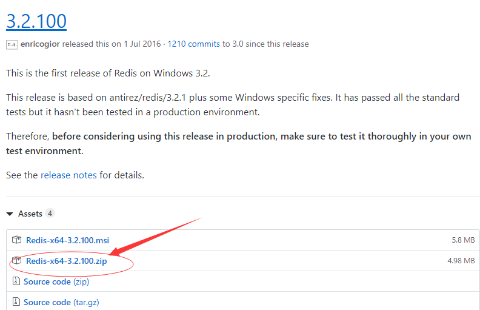
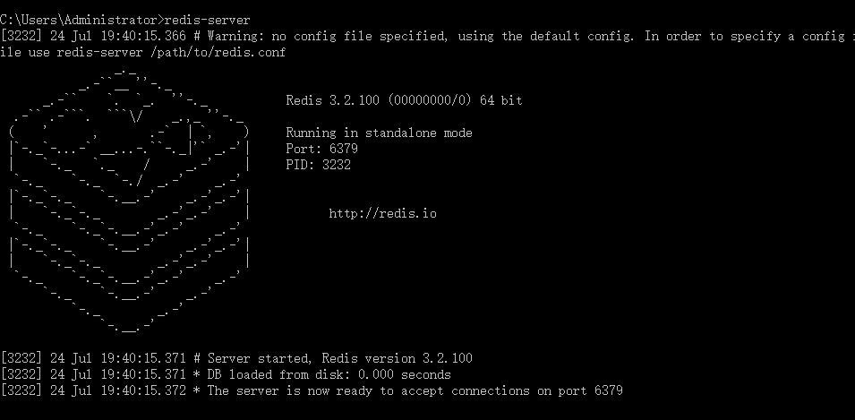
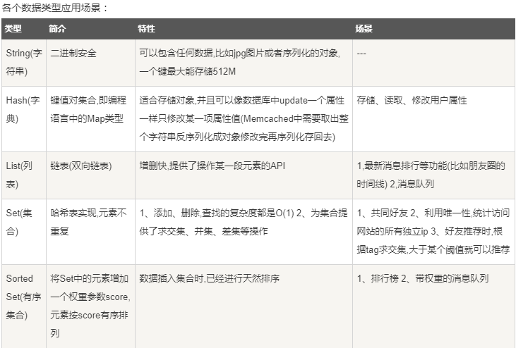
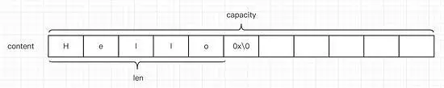
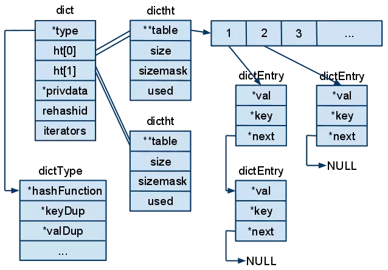

# Redis

  

## 简介

REmote DIctionary Server(Redis) 是一个由Salvatore Sanfilippo写的key-value存储系统。

Redis是一个开源的使用ANSI **C语言编写**、遵守BSD协议、支持网络、可基于内存亦可持久化的日志型、**Key-Value数据库**，并提供多种语言的API。

它通常被称为**数据结构服务器**，因为值（value）可以是 字符串(String), 哈希(Hash), 列表(list), 集合(sets) 和 有序集合(sorted sets)等类型。


# 安装

## 下载地址

官网下载地址:https://github.com/microsoftarchive/redis/releases

 

## 解压

解压Redis-x64-3.2.100.zip - 可以给目录重新命名Redis.

比如:D:\Program File\Redis


## 环境变量配置

在path中添加Redis目录 - D:\Program File\Redis


## 测试

打开cmd - 输入

~~~cmd
redis-server redis.windows.conf
~~~

后面的那个 redis.windows.conf 可以省略，如果省略，会启用默认的。

 

这时候另启一个 cmd 窗口，原来的不要关闭，不然就无法访问服务端了.

~~~java
redis-cli -h 127.0.0.1 -p 6379
~~~

如果redis的服务器端和redis的客户端在同机,直接输入redis-cli即可.

`在远程服务上执行命令`

~~~java
redis-cli -h host -p port -a password
~~~

## 数据库概念

Redis支持多个数据库，并且每个数据库的数据是隔离的不能共享，并且基于单机才有，如果是集群就没有数据库的概念。

Redis是一个字典结构的存储服务器，而实际上一个Redis实例提供了多个用来存储数据的字典，客户端可以指定将数据存储在哪个字典中。这与我们熟知的在一个关系数据库实例中可以创建多个数据库类似，所以可以将其中的每个字典都理解成一个独立的数据库。

每个数据库对外都是一个从0开始的递增数字命名，Redis默认支持16个`数据库（可以通过配置文件支持更多，无上限），可以通过配置databases来修改这一数字。客户端与Redis建立连接后会自动选择0号数据库，不过可以随时使用SELECT命令更换数据库，如要选择1号数据库：

~~~java
C:\Users\Administrator>redis-cli
127.0.0.1:6379> select 1
OK
127.0.0.1:6379[1]>
~~~

# 数据类型

* string（字符串）
* hash（哈希）
* list（列表）
* set（集合）
* zset(sorted set：有序集合)


## 应用场景

 

# 字符串(String)

Redis 字符串数据类型的相关命令用于管理 redis 字符串值，基本语法如下：

~~~java
127.0.0.1:6379> set name success
OK
127.0.0.1:6379> get name
"success"
127.0.0.1:6379>
~~~

在以上实例中我们使用了 **set** 和 **get** 命令，键为 **name**

## 底层原理

~~~java
struct SDS{
    T capacity;        //数组容量

    T len;            //实际长度

    byte flages;    //标志位,低三位表示类型

    byte[] content;    //数组内容
}
~~~

  

* 何时进行扩容?

  当len到达预留的空间的容量的时候,那么会进行扩容操作,扩原来len的1倍.

  但是当数据到达1M的时候,那么就是每次扩容1M的容量.

* 关于编码

  ~~~java
  object encoding key;
  ~~~

  * int - 存储的value是数字

  * embstr - 存储的value的字符的字节<=44

  * raw - 存储的value的字符的字节>44

    如果存储的value的值太大[超过long类型的范围],又会转换成raw

## 常用字符串命令

* SET key value 

  设置指定key的值

* GET key

  获取指定key的值

  ~~~mysql
  127.0.0.1:6379[1]> set name util
  OK
  127.0.0.1:6379[1]> get name
  "util"
  ~~~

* GETRANGE key start end

  返回 key 中字符串值的子字符,start从0开始,代表字符串的下标.

  [start,end]

  ~~~mysql
  127.0.0.1:6379[1]> GETRANGE name 0 2
  "uti"
  ~~~

* GETSET key value

  将给定 key 的值设为 value ，并返回 key 的旧值(old value)。

  ~~~java
  127.0.0.1:6379> getset name success
  "tom"
  127.0.0.1:6379> get name
  "success"
  ~~~

* MGET key1 [key2 ..]

  获取所有(一个或多个)给定 key 的值

  ~~~java
  127.0.0.1:6379> set age 23
  OK
  127.0.0.1:6379> mget name age
  1) "jack"
  2) "23"
  ~~~

* SETEX key seconds value

  将值 value 关联到 key ，并将 key 的过期时间设为 seconds (以秒为单位)。

  ~~~mysql
  127.0.0.1:6379[1]> setex student 20 time
  OK
  127.0.0.1:6379[1]> get student
  "time"
  ~~~

* STRLEN key

  返回key所存储的字符串值的长度

  ~~~mysql
  127.0.0.1:6379[1]> strlen student
  (integer) 0
  ~~~

* INCR key

  将key中存储的数字值增一

  ~~~mysql
  127.0.0.1:6379[1]> incr student
  (integer) 1
  ~~~

* INCR key increment

  将key所存储的值加上给定的增量值(increment)

  

* DECR key

  将key中存储的数字值减一

  ~~~mysql
  127.0.0.1:6379[1]> decr student
  (integer) 0
  ~~~

* DECRBY key decrement

  key 所储存的值减去给定的减量值（decrement)

  

* APPEND key value

  如果 key 已经存在并且是一个字符串， APPEND 命令将指定的 value 追加到该 key 原来值（value）的末尾
  
  ~~~mysql
  127.0.0.1:6379[1]> append student time
  (integer) 5
  ~~~
  
  


# 哈希(Hash)

Redis hash 是一个string类型的field和value的映射表，hash特别适合用于存储对象。Redis 中每个 hash 可以存储 232 - 1 键值对（40多亿）。简单尝试:

~~~java
127.0.0.1:6379> hmset student id 100 name mike age 23 birthday 2012-09-08
127.0.0.1:6379> hgetall student
1) "id"
2) "100"
3) "name"
4) "mike"
5) "age"
6) "23"
7) "birthday"
8) "2012-09-08"    
~~~

我们设置了 redis 的一些描述信息(id, name, age, birthday) 到哈希表的student中

## 底层原理

* 哈希表

  步骤演示:

  ~~~java
  6  12  7  5 把放入容器中
  
  申请长度为12的长度
  6 5 12 7 0 0 0 0 0 0 0 0
      
  会造成空间的浪费
  
  利用哈希表 - 存放数据 - 高效的利用空间   m mod n [取摸的方式]
  比如:6%4 = 2
  
  索引号 -> 0    1    2    3    
           12   5    6    7
      
  未必是连续的 - "散列的特性" - 散列表
  
  比如多了数字 - 9%4=1
  发现俩个key对4取摸的结果都是1 - key的散列值的"冲突性".
  当然是不允许的
      
  索引号 -> 0    1    2    3    
           12   5    6    7
                ^
                |
                9
  每个元素又变成了一个指针 - "链址法"
      		
  ~~~

  Redis底层的hashtable的结构:

   


从这个图中可以得到哪些结论:

hashtable的内部结构分成三层,自底到上-

* dictEntry - 管理一个key-value,同时保留了同一个桶中相邻元素的指针next

  ​		 - 维护哈希桶的内部链.

* dictht - 维护哈希表的所有的桶链.

* dict - 从ht[0]和ht[1]发现底层采用的是"双哈希".当dictht需要"扩容/缩容"的是

  用来管理dictht

## 常用命令

* HMSET key field1 value1 [field2 value2..]
  同时将多个 field-value (域-值)对设置到哈希表 key 中。

* ~~~mysql
  127.0.0.1:6379[1]> hmset student name girl
OK
  127.0.0.1:6379[1]> hgetall student
  1) "id"
  2) "100"
  3) "name"
  4) "girl"
  5) "age"
  6) "23"
  7) "birthday"
  8) "2012-09-08"
  ~~~
  
* HGETALL key

  获取在哈希表中指定 key 的所有字段和值

  ~~~mysql
  127.0.0.1:6379[1]> HGETALL student
  1) "id"
  2) "100"
  3) "name"
  4) "girl"
  5) "age"
  6) "23"
  7) "birthday"
  8) "2012-09-08"
  ~~~

* HGET key field

  获取存储在哈希表中指定字段的值

  ~~~mysql
  127.0.0.1:6379[1]> hget student age
  "23"
  ~~~

* HMGET key field [field2 ..]

  获取所有给定字段的值

  ~~~java
  127.0.0.1:6379> HMGET student id name
  100
  mike
  ~~~

* HEXISTS key field

  查看哈希表 key 中，指定的字段是否存在.如果存在,返回1,否则返回0

  ~~~mysql
  127.0.0.1:6379[1]> hget student age
  "23"
  ~~~

* HDEL key field1 [feild2..]

  删除一个或多个哈希表字段

  ~~~mysql
  127.0.0.1:6379[1]> hdel student 100
  (integer) 0
  127.0.0.1:6379[1]> HGETALL student
  1) "id"
  2) "100"
  3) "name"
  4) "girl"
  5) "age"
  6) "23"
  7) "birthday"
  8) "2012-09-08"
  ~~~

  

* HKEYS key

  获取所有哈希表中的字段

  ~~~java
  127.0.0.1:6379> HKEYS student
  id
  name
  age
  birthday
  ~~~

* HSET key field vlaue

  将已经存在的key的field字段的值修改为value

  ~~~java
  127.0.0.1:6379> HMGET student id name
  100
  mike
  127.0.0.1:6379> HSET student name sus
  0
  127.0.0.1:6379> HGET student name
  sus
  ~~~

* HVALS key

  获取哈希表中所有值

~~~mysql
127.0.0.1:6379[1]> hvals student
1) "100"
2) "girl"
3) "23"
4) "2012-09-08"
~~~


# 列表(List)

Redis列表是简单的字符串列表，按照插入顺序排序。你可以添加一个元素到列表的头部（左边）或者尾部（右边）

一个列表最多可以包含 2^32 - 1 个元素 (4294967295, 每个列表超过40亿个元素),

简单尝试:

~~~java
127.0.0.1:6379> lpush language java
1
127.0.0.1:6379> lpush language redis
2
127.0.0.1:6379> lpush language mongodb
3
127.0.0.1:6379> lrange language 0 2
mongodb
redis
java
127.0.0.1:6379> lrange language 0 1
mongodb
redis
~~~

## 常用命令

* LPUSH key value1 [value2]

  将一个或多个值插入到列表头部

  ~~~mysql
  127.0.0.1:6379[1]> lpush language python
  (integer) 4
  127.0.0.1:6379[1]> lrange language 0 4
  1) "python"
  2) "mongodb"
  3) "redis"
  4) "java"
  ~~~

* LLEN key

  获取列表长度

  ~~~mysql
  127.0.0.1:6379[1]> llen language
  (integer) 4
  ~~~

* LINDEX key index

​     通过索引获取列表的长度

~~~mysql
127.0.0.1:6379[1]> lindex language 0
"redis"
~~~

* LPOP key

  移出并获取列表中的第一个元素

  ~~~mysql
  127.0.0.1:6379[1]> LPOP language
  "python"
  ~~~

* LPUSHX key value

  将一个值插入到已存在的列表头部

  ~~~mysql
  127.0.0.1:6379[1]> lpushx language python
  (integer) 4
  127.0.0.1:6379[1]> lrange language 0 4
  1) "python"
  2) "mongodb"
  3) "redis"
  4) "java"
  ~~~

* LRANGE key start stop

  对一个列表进行修剪(trim)，就是说，让列表只保留指定区间内的元素，不在指定区间之内的元素都将被删除。

  ~~~mysql
  127.0.0.1:6379[1]> lrange language 0 1
  1) "python"
  2) "mongodb"
  ~~~

* LREM key count value

  移出列表指定个数的元素

  ~~~mysql
  127.0.0.1:6379[1]> lrem language 3 python
  (integer) 1
  127.0.0.1:6379[1]> lrange language 0 4
  1) "mongodb"
  2) "redis"
  3) "java"
  ~~~

* LSET key index value

  修改列表指定所引处的值为value

  ~~~java
  127.0.0.1:6379[1]> lrange language 0 4
  1) "mongodb"
  2) "redis"
  3) "java"
  127.0.0.1:6379[1]> lset language 1 python
  OK
  127.0.0.1:6379[1]> lrange language 0 4
  1) "mongodb"
  2) "python"
  3) "java"
  ~~~

  

* LTRIM key start stop

  对一个列表进行截取,让列表只保留指定区间内的元素,不在指定区间内的元素将会被删除.

  ~~~java
  127.0.0.1:6379[1]> ltrim language 0 2
  OK
  127.0.0.1:6379[1]> lrange language 0 4
  1) "mongodb"
  2) "python"
  3) "java"
  ~~~

  

* RPOP key

  移出列表的最后一个元素,返回值为移除的元素

  ~~~mysql
  127.0.0.1:6379[1]> rpop language
  "java"
  ~~~

  

* RPOPLPUSH source destination

  移除列表的最后一个元素,并将该元素添加到另一个列表并返回

  ~~~mysql
  127.0.0.1:6379[1]> RPOPLPUSH source destination
  (nil)
  ~~~

  

* RPUSH key value1 [value2]

  在列表中添加一个或者多个值

  ~~~mysql
  127.0.0.1:6379[1]> rpush language [num joo]
  (integer) 6
  127.0.0.1:6379[1]> lrange language 0 6
  1) "redis"
  2) "c++"
  3) "mongodb"
  4) "python"
  5) "[num"
  6) "joo]"
  ~~~

* RPUSHX key value

  为已经存在的列表添加值

  ~~~mysql
  127.0.0.1:6379[1]> rpushx language scoo
  (integer) 7
  127.0.0.1:6379[1]> lrange language 0 6
  1) "redis"
  2) "c++"
  3) "mongodb"
  4) "python"
  5) "[num"
  6) "joo]"
  7) "scoo"
  ~~~

  

* BLPOP key1 [key2] timeout

  移出并获取列表的第一个元素， 如果列表没有元素会阻塞列表直到等待超时或发现可弹出元素为止

  ~~~java
  127.0.0.1:6379> blpop language 2
  language
  mongodb
  127.0.0.1:6379> lrange language 0 5
  c
  python
  java
  127.0.0.1:6379> lpush test java
  1
  127.0.0.1:6379> blpop test 1
  test
  java
  127.0.0.1:6379> blpop test 1
  
  (1.10s)
  ~~~

* BRPOP key1 [key2] timeout

  移出并获取列表的最后一个元素， 如果列表没有元素会阻塞列表直到等待超时或发现可弹出元素为止。
  
  ~~~mysql
  127.0.0.1:6379[1]> brpop language chinese 2
  1) "language"
  2) "scoo"
  127.0.0.1:6379[1]> lrange language 0 6
  1) "redis"
  2) "c++"
  3) "mongodb"
  4) "python"
  5) "[num"
  6) "joo]"
  127.0.0.1:6379[1]> lrange chinese 0 3
  (empty list or set)
  127.0.0.1:6379[1]>
  ~~~
  
  

# 集合(Set)

Redis 的 Set 是 String 类型的无序集合。集合成员是唯一的，这就意味着集合中不能出现重复的数据。

Redis 中集合是通过哈希表实现的，所以添加，删除，查找的复杂度都是 O(1)。

集合中最大的成员数为 2^32 - 1 (4294967295, 每个集合可存储40多亿个成员)。

简单尝试:

~~~java
127.0.0.1:6379> sadd pro java
(integer) 1
127.0.0.1:6379> sadd pro java
(integer) 0
127.0.0.1:6379> sadd pro mysql
(integer) 1
127.0.0.1:6379> sadd pro python
(integer) 1
127.0.0.1:6379> smembers pro
1) "python"
2) "mysql"
3) "java"
~~~

## 常用命令

* SADD key member1 [member2 ...]

  向集合添加一个或多个成员

  ~~~mysql
  127.0.0.1:6379[1]> sadd setdemo one
  (integer) 1
  127.0.0.1:6379[1]> sadd setdemo two
  (integer) 1
  127.0.0.1:6379[1]> sadd setdemo three
  (integer) 1
  127.0.0.1:6379[1]> sadd setdemo four
  (integer) 1
  127.0.0.1:6379[1]> smembers setdemo
  1) "two"
  2) "four"
  3) "one"
  4) "three"
  ~~~

  

* SCARD key

  获取集合的成员的个数

  ~~~mysql
  127.0.0.1:6379[1]> scard setdemo
  (integer) 4
  ~~~

  

* SDIFF key1 [key2]

  返回俩个集合的差集

  ~~~mysql
  127.0.0.1:6379[1]> sdiff setdemo setdemo
  (empty list or set)
  ~~~

* SINTER key1 [key2]

  返回俩个集合的交集

  ~~~mysql
  127.0.0.1:6379[1]> sinter setdemo setdemo
  1) "two"
  2) "four"
  3) "one"
  4) "three"
  ~~~

* SISMEMBER key member

  判断member元素是否是集合key的成员

  ~~~mysql
  127.0.0.1:6379[1]> sismember setdemo member
  (integer) 0
  不在
  ~~~

* SMEMBERS key

  返回集合中的所有的成员

  ~~~mysql
  127.0.0.1:6379[1]> smembers setdemo
  1) "two"
  2) "four"
  3) "one"
  4) "three"
  ~~~

  

* SPOP key

  移除并返回集合中的一个随机元素

  ~~~mysql
  127.0.0.1:6379[1]> spop setdemo
  "two"
  ~~~

  

* SRANDMEMBER key [count]

  返回集合中的一个随机元素

  ~~~mysql
  127.0.0.1:6379[1]> srandmember setdemo 1
  1) "three"
  ~~~

  

* SREM key member1 [member2]

  移除集合中一个或者多个成员

  ~~~mysql
  127.0.0.1:6379[1]> srem key setdemo language
  (integer) 0
  ~~~

  

* SUNION key1 [key2]

  返回所有给定集合的并集

~~~mysql
127.0.0.1:6379[1]> sunion setdemo setdemo
1) "one"
2) "four"
3) "three"
~~~


# 有序集合(sorted set)

Redis 有序集合和集合一样也是string类型元素的集合,且不允许重复的成员。

不同的是每个元素都会关联一个double类型的分数。redis正是通过分数来为集合中的成员进行从小到大的排序。

有序集合的成员是唯一的,但分数(score)却可以重复。

集合是通过哈希表实现的，所以添加，删除，查找的复杂度都是O(1)。 集合中最大的成员数为 232 - 1 (4294967295, 每个集合可存储40多亿个成员)。简单尝试:

~~~java
127.0.0.1:6379> zadd home 2 mysql
(integer) 1
127.0.0.1:6379> zadd home 1 python
(integer) 1
127.0.0.1:6379> zadd home 3 java
(integer) 1
127.0.0.1:6379> zadd home 4 mysql
(integer) 0
127.0.0.1:6379> zrange home 0 10 withscores
1) "python"
2) "1"
3) "java"
4) "3"
5) "mysql"
6) "4"
127.0.0.1:6379> zrange home 0 10
1) "python"
2) "java"
3) "mysql"
~~~

## 常用命令

* ZADD key score1 member1 [score2 member2]

  向有序集合添加一个或多个成员,或者更新已存在成员的分数

  ~~~mysql
  127.0.0.1:6379[1]> zadd home 3 mbb
  (integer) 1
  127.0.0.1:6379[1]> zrange home 0 10
  1) "python"
  2) "mysql"
  3) "java"
  4) "mbb"
  ~~~

* ZCARD key

  获取有序集合的成员数

* 略

* ~~~mysql
  127.0.0.1:6379[1]> zrange home 0 10
  1) "python"
  2) "mysql"
  3) "java"
  4) "mbb"
  127.0.0.1:6379[1]> zcard home
  (integer) 4
  ~~~

  # Redis持久化

  - RDB[默认的配置方式 - 开启状态]

    ```java
    RDB持久化是指在指定的时间间隔内将内存中的数据集快照写入磁盘，实际操作过程是fork一个子进程，先将数据集写入临时文件，写入成功后，再替换之前的文件，用二进制压缩存储。
    
    1.	默认开启，会按照配置的指定时间将内存中的数据快照到磁盘中，创建一个dump.rdb文件，redis启动时再恢复到内存中。
    2.	redis会单独创建fork()一个子进程，将当前父进程的数据库数据复制到子进程的内存中，然后由子进程写入到临时文件中，持久化的过程结束了，再用这个临时文件替换上次的快照文件，然后子进程退出，内存释放。
    3.	需要注意的是，每次快照持久化都会将主进程的数据库数据复制一遍，导致内存开销加倍，若此时内存不足，则会阻塞服务器运行，直到复制结束释放内存；都会将内存数据完整写入磁盘一次，所以如果数据量大的话，而且写操作频繁，必然会引起大量的磁盘I/O操作，严重影响性能，并且最后一次持久化后的数据可能会丢失；
    ```

  - AOF

    ```java
    AOF持久化以日志的形式记录服务器所处理的每一个写、删除操作，查询操作不会记录，以文本的方式记录，可以打开文件看到详细的操作记录。
    
    
    0.	以日志的形式记录每个写操作（读操作不记录），只需追加文件但不可以改写文件，redis启动时会根据日志从头到尾全部执行一遍以完成数据的恢复工作。包括flushDB也会执行。
    1.	主要有两种方式触发：有写操作就写、每秒定时写（也会丢数据）。
    2.	因为AOF采用追加的方式，所以文件会越来越大，针对这个问题，新增了重写机制，就是当日志文件大到一定程度的时候，会fork出一条新进程来遍历进程内存中的数据，每条记录对应一条set语句，写到临时文件中，然后再替换到旧的日志文件（类似rdb的操作方式）。默认触发是当aof文件大小是上次重写后大小的一倍且文件大于64M时触发；
    4.	当两种方式同时开启时，数据恢复redis会优先选择AOF恢复。一般情况下，只要使用默认开启的RDB即可，因为相对于AOF，RDB便于进行数据库备份，并且恢复数据集的速度也要快很多。
    5.	开启持久化缓存机制，对性能会有一定的影响，特别是当设置的内存满了的时候，更是下降到几百reqs/s。所以如果只是用来做缓存的话，可以关掉持久化。
    ```

  ## RDB存在哪些优势呢？

  1). 一旦采用该方式，那么你的整个Redis数据库将只包含一个文件，这对于文件备份而言是非常完美的。比如，你可能打算每个小时归档一次最近24小时的数据，同时还要每天归档一次最近30天的数据。通过这样的备份策略，一旦系统出现灾难性故障，我们可以非常容易的进行恢复。

  2). 对于灾难恢复而言，RDB是非常不错的选择。因为我们可以非常轻松的将一个单独的文件压缩后再转移到其它存储介质上。

  3). 性能最大化。对于Redis的服务进程而言，在开始持久化时，它唯一需要做的只是fork出子进程，之后再由子进程完成这些持久化的工作，这样就可以极大的避免服务进程执行IO操作了。

  4). 相比于AOF机制，如果数据集很大，RDB的启动效率会更高。

  ## RDB又存在哪些劣势呢？

  1). 如果你想保证数据的高可用性，即最大限度的避免数据丢失，那么RDB将不是一个很好的选择。因为系统一旦在定时持久化之前出现宕机现象，此前没有来得及写入磁盘的数据都将丢失。

  2). 由于RDB是通过fork子进程来协助完成数据持久化工作的，因此，如果当数据集较大时，可能会导致整个服务器停止服务几百毫秒，甚至是1秒钟。

  ## AOF的优势有哪些呢？

  1). 该机制可以带来更高的数据安全性，即数据持久性。Redis中提供了3中同步策略，即每秒同步、每修改同步和不同步。事实上，每秒同步也是异步完成的，其效率也是非常高的，所差的是一旦系统出现宕机现象，那么这一秒钟之内修改的数据将会丢失。而每修改同步，我们可以将其视为同步持久化，即每次发生的数据变化都会被立即记录到磁盘中。可以预见，这种方式在效率上是最低的。至于无同步，无需多言，我想大家都能正确的理解它。

  2). 由于该机制对日志文件的写入操作采用的是append模式，因此在写入过程中即使出现宕机现象，也不会破坏日志文件中已经存在的内容。然而如果我们本次操作只是写入了一半数据就出现了系统崩溃问题，不用担心，在Redis下一次启动之前，我们可以通过redis-check-aof工具来帮助我们解决数据一致性的问题。

  3). 如果日志过大，Redis可以自动启用rewrite机制。即Redis以append模式不断的将修改数据写入到老的磁盘文件中，同时Redis还会创建一个新的文件用于记录此期间有哪些修改命令被执行。因此在进行rewrite切换时可以更好的保证数据安全性。

  4). AOF包含一个格式清晰、易于理解的日志文件用于记录所有的修改操作。事实上，我们也可以通过该文件完成数据的重建。

  ## AOF劣势

  ```java
  1). 对于相同数量的数据集而言，AOF文件通常要大于RDB文件。RDB 在恢复大数据集时的速度比 AOF 的恢复速度要快。
  
  2). 根据同步策略的不同，AOF在运行效率上往往会慢于RDB。总之，每秒同步策略的效率是比较高的，同步禁用策略的效率和RDB一样高效。
  
  二者选择的标准，就是看系统是愿意牺牲一些性能，换取更高的缓存一致性（aof），还是愿意写操作频繁的时候，不启用备份来换取更高的性能，待手动运行save的时候，再做备份（rdb）。rdb这个就更有些 eventually consistent的意思了。
  ```

  ## 常用配置

  - RDB

    ```java
    Redis会将数据集的快照dump到dump.rdb文件中。此外，我们也可以通过配置文件来修改Redis服务器dump快照的频率，在打开6379.conf文件之后，我们搜索save，可以看到下面的配置信息：
    
    save 900 1              #在900秒(15分钟)之后，如果至少有1个key发生变化，则dump内存快照。
    
    save 300 10            #在300秒(5分钟)之后，如果至少有10个key发生变化，则dump内存快照。
    
    save 60 10000        #在60秒(1分钟)之后，如果至少有10000个key发生变化，则dump内存快照
    ```

  - AOF

    ```java
    在Redis的配置文件中存在三种同步方式，它们分别是：
    
    appendfsync always     #每次有数据修改发生时都会写入AOF文件。
    
    appendfsync everysec  #每秒钟同步一次，该策略为AOF的缺省策略。
    
    appendfsync no          #从不同步。高效但是数据不会被持久化。
    ```

    


